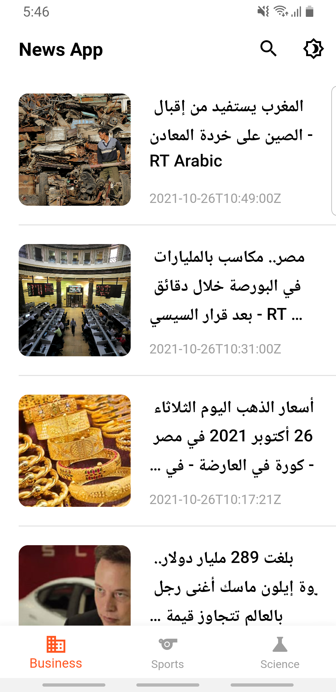
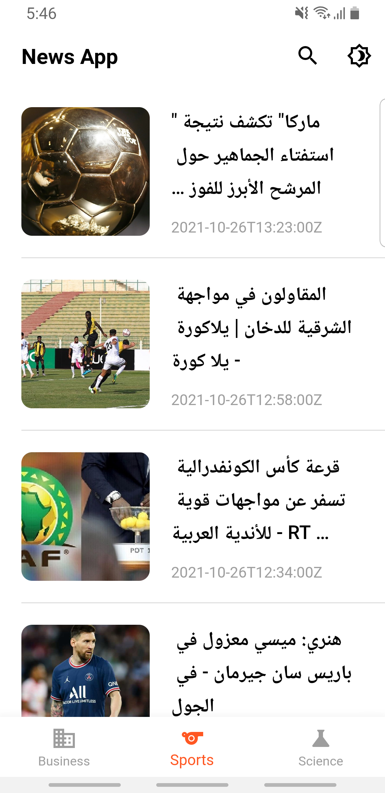
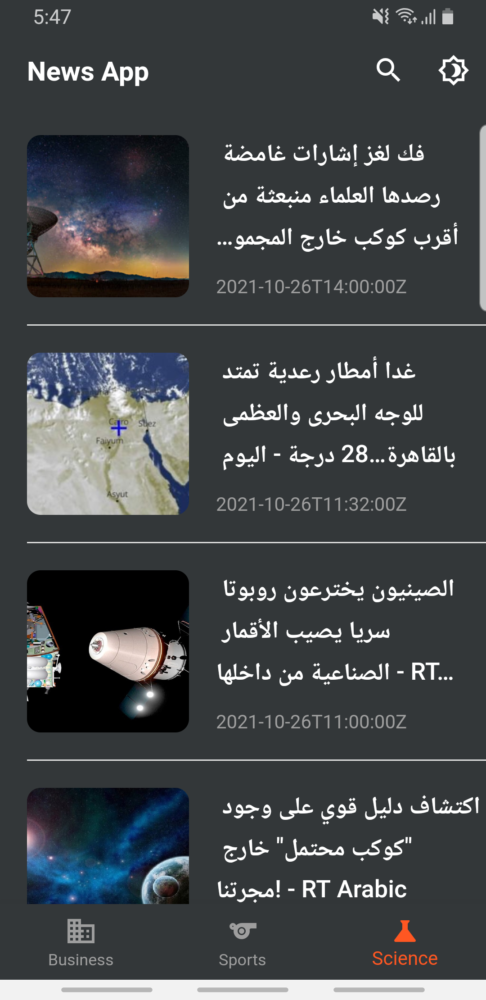
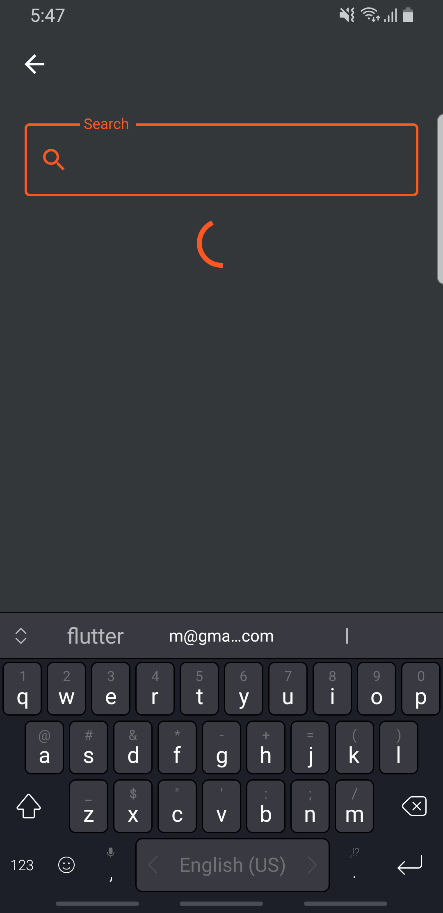
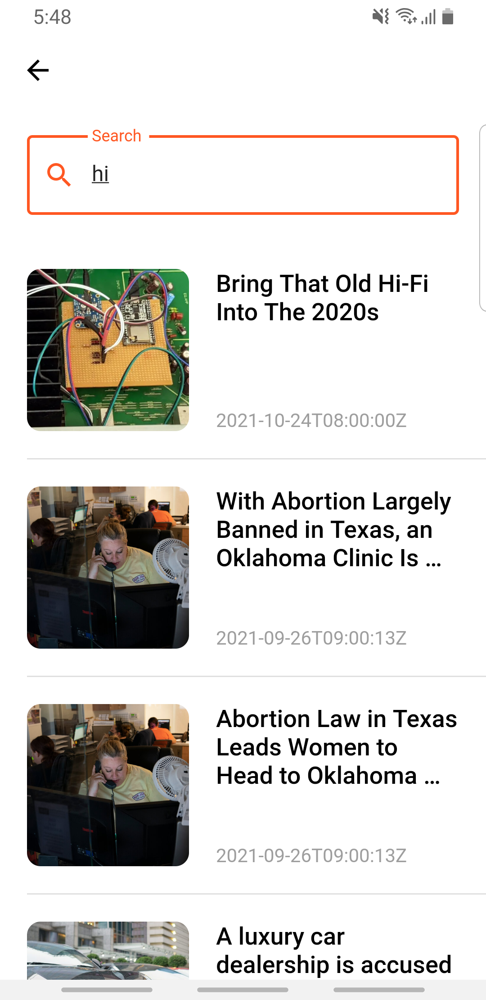

# news app

This is a news application. I made it to learn the all basics of the REST APIS (using Dio package), Shared Preference and State Management (Bloc). This app connects to the APIS to show the user all news based on the category like (Sports-Business-Science). Also it has the dark mode option.

## Tools

- Backend: REST APIS
- State management:
    - Bloc Design Pattern

- Packages:
    - bloc
    - flutter_bloc
    - dio
    - conditional_builder_null_safety
    - shared_preferences
    - webview_flutter

## Video

https://user-images.githubusercontent.com/81096412/139444928-5ab2aac8-18d2-4dd0-8541-65ed550254e4.mp4

## Screenshots

<table>
  <tr>
    <td></td>
    <td></td>
    <td></td>
  </tr>
 </table>

<table>
  <tr>
    <td></td>
    <td></td>
  </tr>
 </table>
